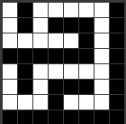
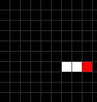
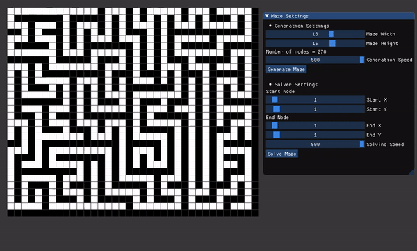

#  Maze Generator And Solver

A simple maze generator and solver implemented using concepts of Data Structure And Algorithms in C++ Programming language using Opengl. The project is build using visual studio 2019 community edition.

## Generation of maze
The maze is generated using depth first search algorithm. In this algorithm, the maze is generated by randomly selecting a cell and then randomly selecting one of the four adjacent cells. If the selected cell is not already part of the maze, then it is added to the maze. If the selected cell is already part of the maze, then the algorithm backtracks and selects another cell.The process is repeated until the maze is completely generated.
#### Generation for 5x5 maze


## Solving the maze
The maze is solved using Dijkstra's algorithm. Given the generated maze and a source vertex in the graph, it finds the shortest paths from the source vertex to all vertices in the generated maze.

## ⚙ Usage
```bash
$ git clone https://github.com/SrjPdl/Maze-Generator-Solver.git
```
After clonig repo open `Maze.sln` file in visual studio 2019 community edition. Then build the project. For more info related to setting up include directorys and linking libraries in case of errors , see [res/help.md](res/help.md) file.

## 💻 Full Demo
[](res/demo.gif)

## 🚀 Author
**Suraj Poudel**

## License
[](https://opensource.org/licenses/MIT)