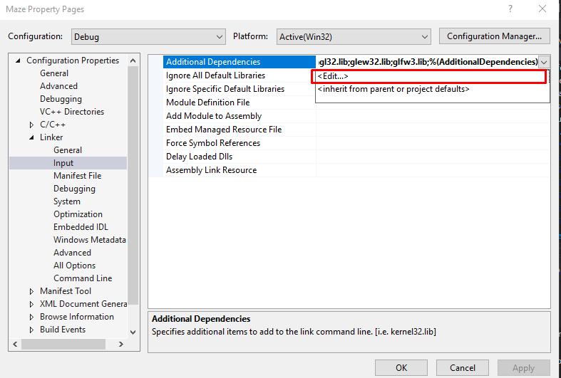

# Setting up include directories and linking libraries

1. Right click on `Maze.sln` file and select `Properties`
    
    
2. In the `Properties` window, click on `C/C++` tab and click on `General` tab
  
3. In the `General` tab, click on `Additional Include Directories` and click on `Edit`
  
4. In the `Edit` window, add the following directories to the `Additional Include Directories`
  
```
$(SolutionDir)\externalLibraries\GLFW\include
```
```
$(SolutionDir)\externalLibraries\GLEW\include
```
```
$(SolutionDir)\externalLibraries\GLM
```
```
$(SolutionDir)\externalLibraries\imgui\Imgui
```


5. In the `Properties` window, click on `Linker` tab and click on `General` tab
6. In the `General` tab, click on `Additional Library Directories` and click on `Edit`
   

7. In the `Edit` window, add the following directories to the `Additional Library Directories`
  ```
  $(SolutionDir)\externalLibraries\GLFW\lib-vc2019
  ```
  ```
  $(SolutionDir)\externalLibraries\GLEW\lib\Release\Win32
  ```
8. In the `Linker` tab, click on `Input` tab and click on `Additional Dependencies` and click on `Edit`
   

9. Add the following libraries to the `Additional Dependencies`
    ```
    opengl32.lib
    glew32.lib
    glfw3.lib
    ```

In all steps click on `Apply` and click on `OK` wherever necessary. 